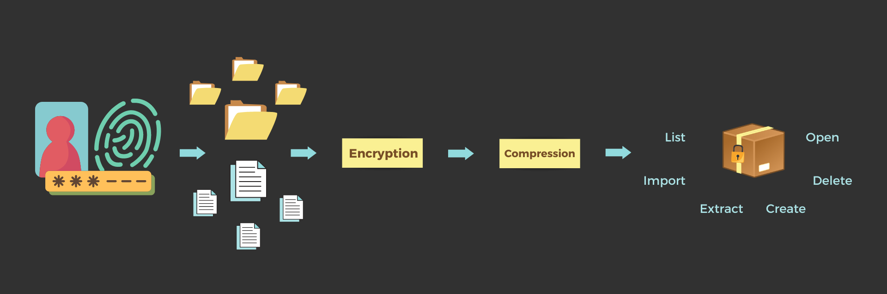
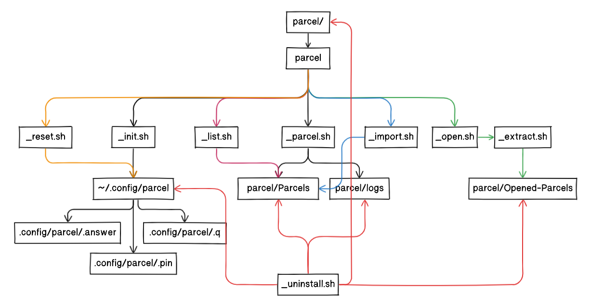




# Parcel v1.0.0

Parcel is an archiving and encrypting algorithm used to store and protect files in an easy to use way. Just run selected files and folders through Parcel and it will create a ***.parcel*** archive containing compressed and encrypted versions of all of your files and data.
Parcel will store your .parcel archives in a hidden folder on your computer to keep your data out of sight of any prying eyes!



## [Table Of Contents](#toc)
  - [Table Of Contents](#table-of-contents)
  - [About](#about)
  - [Install](#install)
    - [Manual Install:](#manual-install)
    - [Command-Line Install:](#command-line-install)
  - [Dependencies](#dependencies)
  - [Configuration](#configuration)
  - [Usage](#usage)
  - [Documentation](#documentation)
    - [Exports](#exports)
    - [Archiving Methods](#archiving-methods)
    - [Encryption Methods](#encryption-methods)
  - [Contributing](#contributing)
  - [Security](#security)
  - [Contacts](#contacts) 

---

## [About](#about)

Parcel will add layers of security such as encryption, encoding, scrambling, pin protection and compression on top of your files and folders then bundle them into a .parcel archive which is then hidden on your computer. The aim is to make it as hard as possible to get to the data within the .parcel. I hope to make it so that the only feasible way to open a .parcel is to use the Parcel program itself. If you can easily manually reverse engineer it then it's no good!  
This is parcel v1.0.0, but as I research and advance the algorithm in turn adding new encryption and archiving methods I will be updating frequently until I've done all I can.

---

## [Install](#install)

### Manual Install:
1. Download and place the ***Parcel*** folder in a location of your choosing.
2. For convenience you should put Parcel on your `PATH` or in a place that is already on your `$PATH` global variable.

### Command-Line Install:
1. Clone the repository: Open your terminal and navigate to the directory where you want to clone the repository. Run the following command:
```bash
git clone https://github.com/happycod3r/Parcel.git
```

2. Navigate to the script directory: Change your working directory to the cloned repository's directory:
```bash
cd Parcel
```

If necessary, make Parcel executable. You can use the chmod command for this:
```bash
cd path/to/parcel
sudo chmod +x parcel
```

## [Dependencies](#dependencies)

**Parcel** only has 2 dependencies, these being **fzf** the command line fuzzy finder and **arc** pc archiving utility, and both are packaged with it, so there is no need to actually install anything. 

#### fzf - https://github.com/junegunn/fzf

#### arc - https://manpages.ubuntu.com/manpages/xenial/man1/arc.1.html  
---

## [Configuration](#configuration)
Parcel will have you configure it the first time it is run. You will have to set a 4 digit pin and a security question which will be used to access your data and to perform other operations within Parcel.  


## [Usage](#usage)

> To create an encrypted .parcel archive pass in the absolute file and folder paths in any order. In the current version ***1.0.0.*** Parcel needs to be run from the projects base directory: `parcel/`. I'm currently working on a revision to make it work properly from any directory, so that will be implemented really soon.  
 
```bash 
parcel file1.txt file2.doc myfolder
#or if not on path...
bash parcel file1.txt file2.doc myfolder
```

> To decrypt and extract a .parcel archive use the `-x` or `--extract` option. You don't have to supply an archive name as you will be able to choose which one to unarchive from an interactive list. You can choose more than one at a time.

```bash 
parcel -x
#or
parcel --extract
#or if not on path...
bash parcel -x
#or 
bash parcel --extract
```

> To delete .parcel archives use the `-d` or the `--delete` option. There is no need to specify which archive to delete as you will be able to choose from an interactive list. You can choose multiple at once.

```bash
parcel -d
#or
parcel --delete
#or if not on path...
bash parcel -d
#or 
bash parcel --delete
```

> To clean the *Opened-Parcels* folder use the `-c` or the `--clean` option and follow the prompt to continue. Make sure you have any important data that may be located there first.

```bash
parcel -c
#or
parcel --clean
#or if not on path...
bash parcel -c
#or 
bash parcel --clean
```

> To import a .parcel file from an external location use the `-i` or the `--import` option and specify the path to the .parcel including the .parcel name.

```bash
parcel -i path/to/1CWNRYRPCN.parcel
#or
parcel --import path/to/1CWNRYRPCN.parcel
#or
bash parcel -i path/to/1CWNRYRPCN.parcel
#or
bash parcel --import path/to/1CWNRYRPCN.parcel
```

> To list all .parcel files use the `--list` option.

```bash
parcel --list
#or if not on path
bash parcel --list
```

> To get the currently installed version of .parcel use the `-v` or the `--version` option.

```bash 
parcel -v
#or
parcel --version
#or if not on path...
bash parcel -v
#or
bash parcel --version
```

> To view the install location of .parcel use the `-l` or the `--get-location` option.

```bash 
parcel -l
#or
parcel --get-location
#or if not on path...
bash parcel -l
#or
bash parcel --get-location
```

> To reset your pin use the `--reset` option.

```bash
parcel --reset
#or if not on path...
bash parcel --reset
```

> To view these options on the command line use the `-h` or the `--help` option.

```bash
parcel -h
#or
parcel --help
#or if not o path...
bash parcel -h
#or
bash parcel --help
```

> To uninstall .parcel use the  `--uninstall` option and follow the prompts to continue.

```bash
parcel --uninstall
#or
bash parcel --uninstall
```
---

## [Documentation](#docs)

As I mentioned in the Usage section, for now in version 1.0.0. Parcel needs to be run from within its base directory: `parcel/` This is because a lot of Parcels functions rely on files and folders being in a specific place for them to work properly and it always searches relative to where the `parcel` command is run. If you run it from `~/` for example it will look relative to the home directory which is not good. The following image is a layout of the current file and folder structure that is being relied on by Parcel.



The following is a brief description of the archiving and encryption methods used within Parcel.
 
### [Archiving Methods](#archiving-methods)
- **ARC** - "ARC" is a file compression and archival format that was developed in the 1980s by System Enhancement Associates (SEA). It was a popular compression format in the early days of personal computing, particularly on MS-DOS-based systems.
- **ZIP** - *"ZIP"* is a file format and a popular compression method used for archiving and compressing files and folders. It stands for "ZiP Archive" or "Zone Information Protocol." The ZIP format allows you to combine multiple files and folders into a single file, reducing their overall size and making it easier to transfer or store them.

--- 

### [Encryption Methods](encryption-methods)
- **OpenSSL** - OpenSSL is a widely-used open-source software library that provides cryptographic functions, including encryption, decryption, digital signatures, and secure communications protocols.
- **base64** - Base64 encoding is not a form of encryption but rather a method of encoding binary data into a text format. The Base64 encoding scheme uses a set of 64 characters (hence the name) that are considered safe for use in text-based situations. These characters include uppercase letters (A-Z), lowercase letters (a-z), numbers (0-9), and two additional symbols (usually '+' and '/'). In some implementations, an additional character such as '=' is used for padding.
---

## [Contributing](#contributing)

If you have any feature requests, suggestions or general questions you can reach me via any of the methods listed below in the [Contacts](#contacts) section.

---

## [Security](#security)

### Reporting a vulnerability or bug?

**Do not submit an issue or pull request**: A general rule of thumb is to never publicly report bugs or vulnerabilities because you might inadvertently reveal it to unethical people who may use it for bad. Instead, you can email me directly at: [paulmccarthy676@gmail.com](mailto:paulmccarthy676@gmail.com). I will deal with the issue privately and submit a patch as soon as possible.

---

## [Contacts](#contacts)

**Author:** Paul M.

* Email: [paulmccarthy676@gmail.com](mailto:paulmccarthy676@gmail.com)
* Github: [https://github.com/happycod3r](https://github.com/happycod3r)
* Linkedin: [https://www.linkedin.com/in/paul-mccarthy-89165a269/]( https://www.linkedin.com/in/paul-mccarthy-89165a269/)
* Facebook: [https://www.facebook.com/paulebeatz]( https://www.facebook.com/paulebeatz)

---
