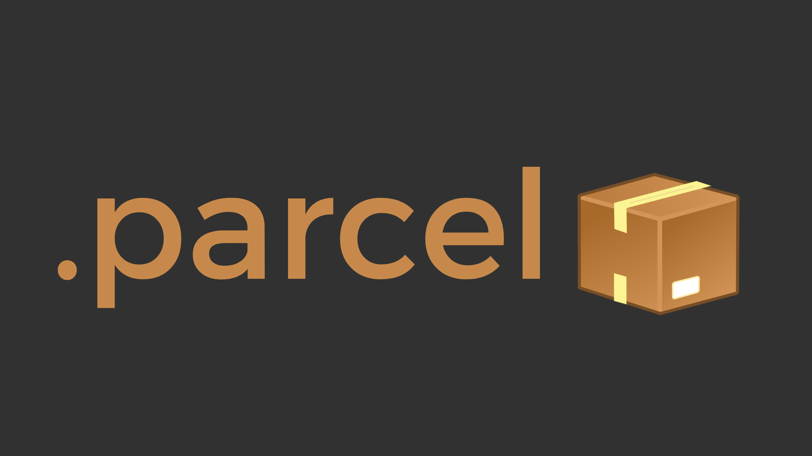

# .parcel

> Parcel is an archiving and encrypting algorythm used to store and protect files in an easy to use way. Just run selected files and folders through Parcel and it will create a ***.parcel*** archive containg encrypted versions of all of your files and data also retaining the original directory structure, permissions and ownership.

## Table Of Contents

---
## About
I have created the ***.parcel*** archive after my companies data was breached. I wanted to create something in which bad actors wouldn't recognize - at least right away. Parcel is not 100% hacker/bad actor proof by any means as nothing really is, but it's my way of trying to create something as close to it as possible. In order to do this I employed multiple layers of encryption, archiving, scrambling methods and ID protected access in order to create as many layers as possible on top of the original data so that anyone trying to get the raw data in a ***.parcel*** archive will have a truly hard time reverse engineering it and getting that data.
Although what happens under the hood of Parcel is complex, Parcel is as easy to use as any other archiving methods such as `.rar` or `.zip` archives. 
---

## USAGE

**Encrypt & Archive**

To create a parcel archive just type ***parcel*** followed by any number of files or folders.
`parcel file1.txt myfolder` 

To extract and decrypt a parcel archive use the `-x` option after ***parcel*** followed by the parcel archive to extract.
`parcel -x DVGSZVODA5.parcel`

## Archiving/Encryption Methods

--- 
